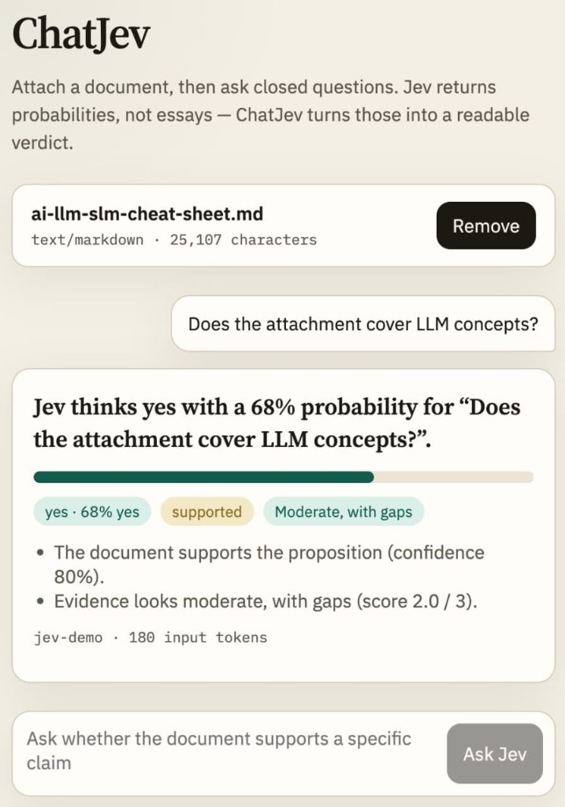

# ChatJev

Ask [Jev](https://learnjev.com/reference) a closed question the way you would prompt an LLM. ChatJev screens the prompt, gathers text evidence (an attached document or a web scrape), and turns Jev’s typed answers (`noul`, `choice`, `score`) into a readable verdict.

Jev is not a chat model. It does not write essays. ChatJev is a Next.js app that uses Jev where it is strong — questions and checking — and falls through to an LLM only when the prompt needs generated prose.

The TypeSafe key stays on the server. The browser only uploads optional files and asks questions.



## How a turn works

1. **Prompt.** Type a question. A document is optional.
2. **Injection screen.** Jev scores whether the text is trying to override instructions. Obvious jailbreak phrases are also blocked in code. This is a chat-turn gate, not a sole control for irreversible actions — TypeSafe is explicit that Jev does not treat state as hostile by default.
3. **Jev-first router.** If the prompt is a closed judgment, Jev answers. If it is a summary, rewrite, or other open-ended request, ChatJev calls an LLM when `AI_GATEWAY_API_KEY` or `OPENAI_API_KEY` is set.
4. **Evidence.** Attached text is used as-is. Otherwise ChatJev searches the public web (DuckDuckGo HTML plus Wikipedia), fetches a few pages, and has Jev drop irrelevant or hostile passages.
5. **Verdict.** Jev returns probabilities. ChatJev writes “Jev thinks yes with a 90% probability…”.

That pipeline is powerful for questions and checking. It will not replace a generative model for drafting or explanation.

## Can Jev prevent prompt injection?

It can **help**, and ChatJev uses it that way. A cheap Noul (“is this an injection?”) plus a Choice (`clean` / `injection` / `jailbreak`) is a good pre-filter, and the same pattern screens scraped passages.

It is not a silver bullet. TypeSafe’s own guidance: state is data, `jev-1.13` does not treat it as hostile by default, and a single Jev answer should not be the only thing standing between untrusted input and an irreversible action. ChatJev therefore combines the Jev screen with a small heuristic and only uses the result to refuse a chat turn.

## Can Jev be a pre-prompt filter before an LLM?

Yes. That is the default router:

- Closed question Jev can score → stay on Jev (document or web evidence).
- Open-ended generation → LLM fallback, if configured.
- Photo / audio / video ask → refuse. Jev is text-only.

Configure the fallback with `AI_GATEWAY_API_KEY` (Vercel AI Gateway) or `OPENAI_API_KEY`. Without a key, open-ended prompts are refused with an explanation.

## Can Jev analyze photos and audio?

No. Jev accepts text, JSON objects, or arrays of text. There is no image, audio, or video input.

ChatJev rejects media uploads and media-shaped questions. If you have a transcript, OCR text, or a caption, attach that as a document and ask a closed question about it. A vision or speech model would have to describe the file first; Jev can then judge the description, not the bytes.

## Feasibility

| Layer                                      | Generic?  | What ChatJev does                                                                        |
| ------------------------------------------ | --------- | ---------------------------------------------------------------------------------------- |
| Domain (medical, legal, finance, anything) | Yes       | Jev evaluates the supplied text. There are no medical- or legal-specific schemas.        |
| File type                                  | Partially | Jev is text-only. ChatJev extracts text from common document types and rejects media.    |
| Question type                              | Partial   | Closed judgments stay on Jev. Open-ended prompts need an LLM.                            |
| Web evidence                               | Yes       | Public pages only. Private IPs and metadata endpoints are blocked.                       |

Jev’s state budget is about **32,000 tokens**. ChatJev estimates 4 characters per token and **truncates with a visible warning** rather than silently chunking.

## Supported files

- Text: `.txt`, `.md`, `.csv`, `.json`, `.html`
- Documents: `.pdf`, `.docx`

Not supported: images, scanned PDFs (no OCR), audio, video, and unknown binaries.

## Local setup

Node 20 or newer. Get a Jev key from [console.typesafe.ai](https://console.typesafe.ai).

```bash
npm install
cp .env.example .env.local
```

Set `TYPESAFE_API_KEY` in `.env.local`. Optional: `TYPESAFE_DEFAULT_MODEL` (defaults to `jev-latest`). Optional LLM fallback: `AI_GATEWAY_API_KEY` or `OPENAI_API_KEY`.

```bash
npm test
npm run dev
```

Open http://127.0.0.1:3000.

To click through the UI without calling TypeSafe or the public web:

```bash
CHATJEV_MOCK_JEV=1 npm run dev
```

## Deploy on Vercel

The app is a standard Next.js project. The Jev key must be a server env var, never `NEXT_PUBLIC_`.

```bash
npx vercel link
echo "$TYPESAFE_API_KEY" | npx vercel env add TYPESAFE_API_KEY production preview development
npx vercel --prod
```

## API

| Method | Path            | Purpose                                                                                          |
| ------ | --------------- | ------------------------------------------------------------------------------------------------ |
| `POST` | `/api/sessions` | Multipart upload (`file`). Returns extracted document text for the next ask.                     |
| `POST` | `/api/ask`      | JSON `{ question, document? }`. Returns a verdict, LLM fallback, injection block, or a refusal.  |
| `GET`  | `/api/health`   | Liveness plus whether an LLM fallback is configured.                                             |

Document or scraped text is held in the browser after extract so Vercel serverless instances do not need shared session memory. After a web-backed verdict, the UI pins that evidence for follow-ups until you clear it.

## Tests

`npm test` uses a fake Jev client and a fake web searcher. CI never calls TypeSafe or the public internet.

## Layout

```
src/core/        ingest, triage, web search, LLM fallback, Jev client, verdict copy
src/lib/         route helpers and browser client
src/app/         Next.js App Router pages and API routes
src/components/  chat UI
tests/           Vitest
```

## Out of scope

- OCR / scanned PDFs / native photo or audio understanding
- Chunk-and-aggregate for book-length documents
- Durable session storage
- Streaming (Jev has no stream endpoint)

## License

[MIT](LICENSE)
